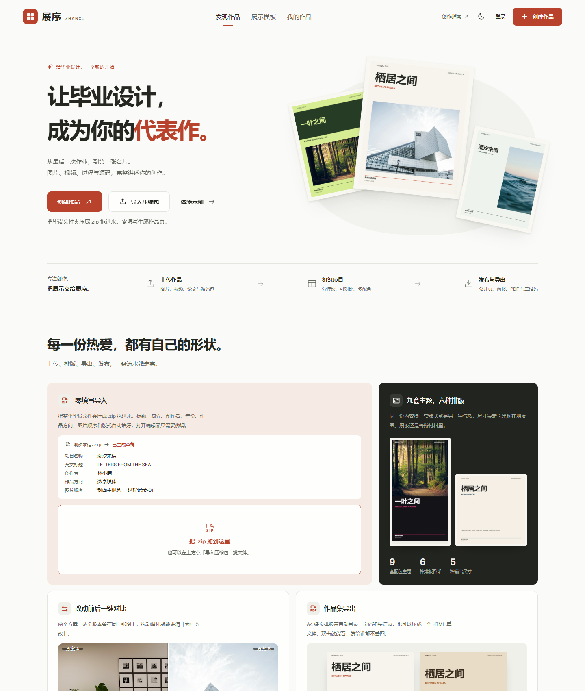
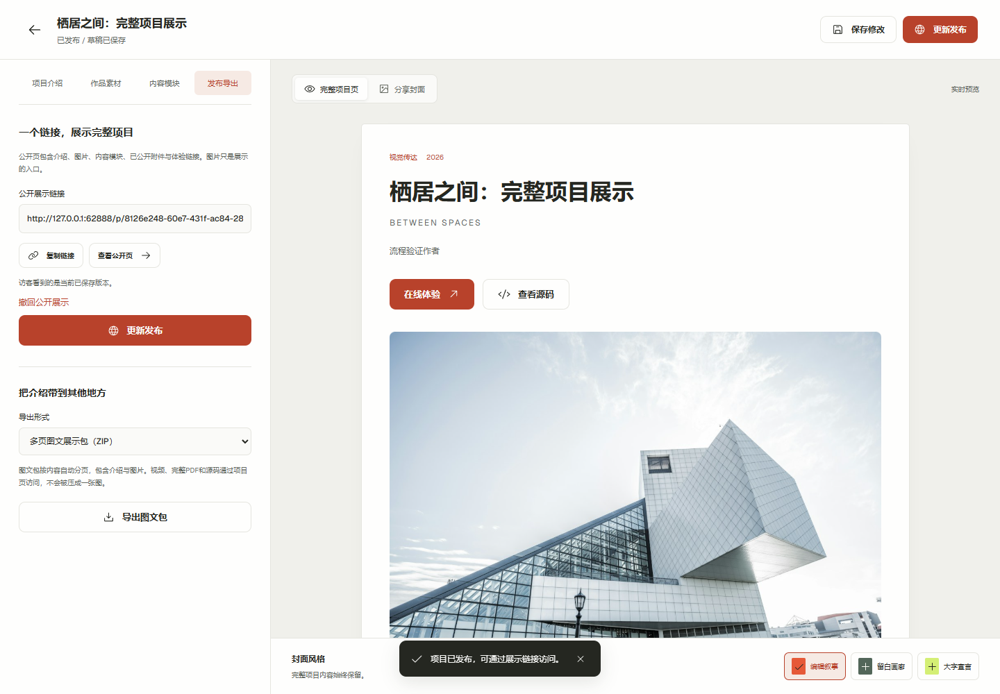
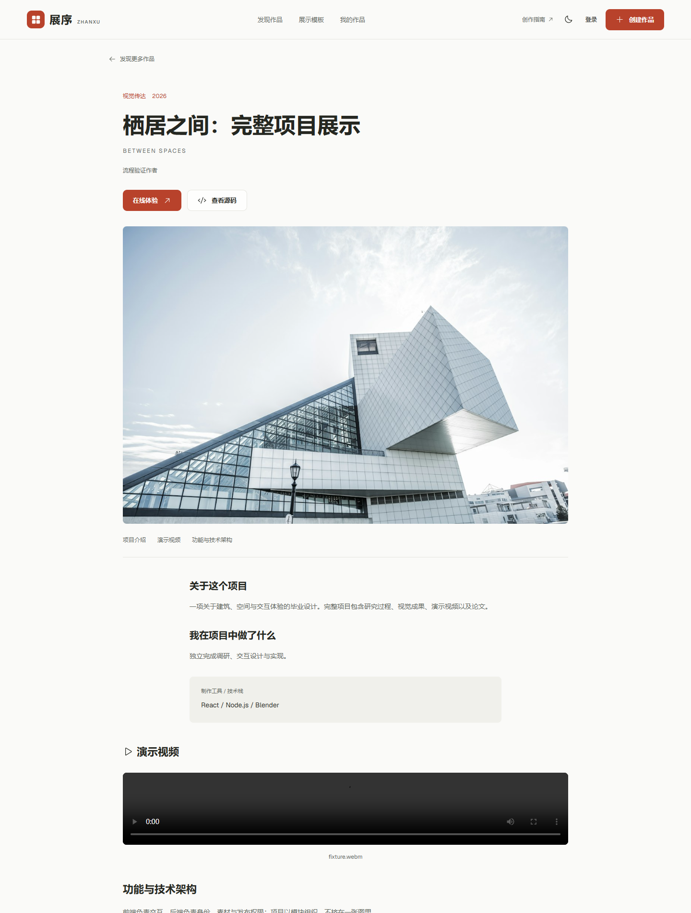
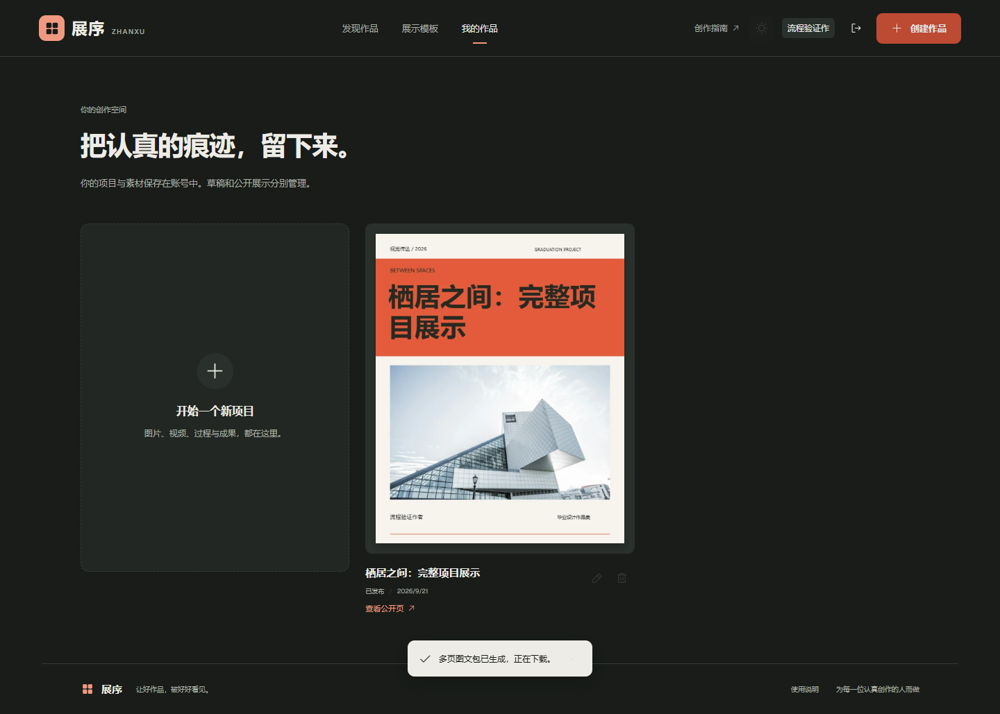
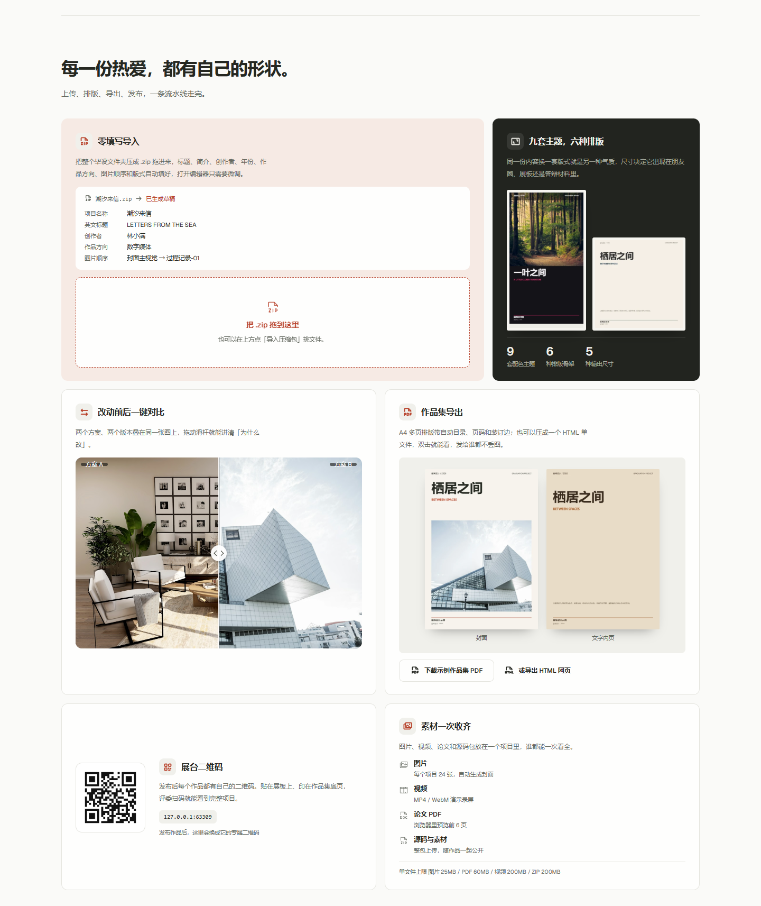
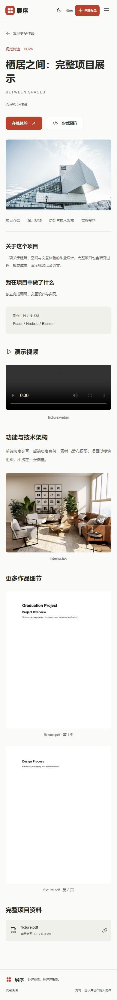
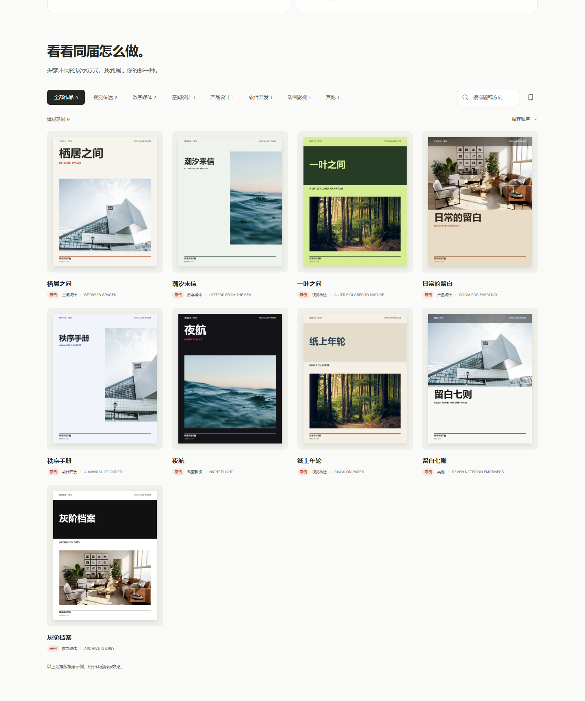

# ZHANXU

[](https://github.com/Ranni-M/zhanxu/actions/workflows/ci.yml)
[](LICENSE)
[](https://nodejs.org)

**Present a graduation project as a complete piece of work.** Upload images, videos, theses and project files, organize the creative process into modules, generate a standalone public page, and export a cover image or a multi-page picture pack.

This is a runnable full-stack application, suitable for personal graduation projects, portfolios, and small-scale sharing on a single server.

[中文 README](README.md) · Live demo: deployment in progress (link will be updated once the domain registration completes)

## Screenshots

| Home                               | Project editor                                 |
| ---------------------------------- | ---------------------------------------------- |
|  |  |

| Public project page                                         | Dark-mode workspace                                         |
| ----------------------------------------------------------- | ----------------------------------------------------------- |
|  |  |

| Home feature showcase                                        | Public page on a phone                                                |
| ------------------------------------------------------------ | --------------------------------------------------------------------- |
|  |  |

| Discover grid: nine template samples                 |
| ---------------------------------------------------- |
|  |

## Features

- Email/password registration, sign-in, sign-out and password change with server-side sessions (scrypt hashing, hashed session tokens, CSRF origin checks, rate limiting).
- A private workspace per account: save, reopen, delete, and recover unsaved changes.
- Project intro, creator, responsibilities, tools, process, live-demo and source-code links.
- Up to 8 free-form content modules with reordering and linked images.
- Upload images, full PDFs, MP4/WebM videos, and ZIP project archives.
- PDFs are parsed in the browser to preview the first 6 pages and attempt abstract extraction; the full file is always kept.
- Standalone public project pages: private drafts are separated from published snapshots; each attachment can be published individually; pages can be updated or withdrawn.
- Zero-fill import: drop a ZIP of the whole project folder and titles, intros, author, year, category and image order are read out into an editable draft.
- Guest mode: create a draft, preview and export a portfolio without an account; publishing asks you to sign in, then the draft moves into your account.
- Multiple colour ways per project, plus a draggable before/after comparison on the public page.
- Discovery of published works with category search, bookmarks and sorting; the feed starts with all nine template samples (real public projects and samples shown together, samples are labelled and cannot be bookmarked).
- Three cover layouts; server-side export of a 1600px-wide PNG cover or an auto-paginated PNG picture pack (ZIP).
- Multi-page A4 portfolio PDF (auto table of contents, page numbers, binding margin), a single-file HTML portfolio (all images inlined, opens offline by double-click) and a booth QR code for print or screen.
- The home page demonstrates import, layout, comparison, export and asset handling with real components.
- Theme switching, mobile layout, keyboard navigation, and reduced-motion support.

**Uploading a ZIP does not run the project.** Software projects should provide a deployed demo URL and a repository link; animation, game, and installation works can upload a demo video instead. The project page presents the full outcome — the cover is only the entry point.

## Quick start

Requires **Node.js 24+**. No external database, cloud storage account, or AI key is needed.

```sh
npm ci
npm run dev
```

Open http://127.0.0.1:5173 in your browser. The frontend on port 5173 proxies the backend on port 3001. Register an account to create a project.

Run a production build:

```sh
npm run build
npm start
```

Open http://127.0.0.1:3001 — this port serves both the web app and the API.

On first launch, `data/zhanxu.sqlite` and `data/files/` are created automatically. These paths are git-ignored; uploaded assets and account data never enter the repository.

## Configuration

Copy `.env.example` to `.env` and adjust as needed. `npm start` reads `.env` automatically; dev commands use local defaults, and every option can also be set via process environment variables.

| Option              | Default                     | Description                                            |
| ------------------- | --------------------------- | ------------------------------------------------------ |
| PORT                | 3001                        | API / production site port                             |
| HOST                | 127.0.0.1                   | 0.0.0.0 inside Docker                                  |
| DATA_DIR            | ./data                      | Persistence directory for SQLite and files             |
| PUBLIC_ORIGIN       | Local dev origin            | Required in production, e.g. https://portfolio.example |
| COOKIE_SECURE       | Inferred from PUBLIC_ORIGIN | Should be true for HTTPS production sites              |
| TRUST_PROXY         | Not trusted                 | Set to 1 only behind exactly one trusted reverse proxy |
| MAX_USER_STORAGE_MB | 500                         | Per-account upload storage limit                       |
| ALLOW_REGISTRATION  | true                        | Set to false to close new account registration         |

## Verification

```sh
npm test
npm run build
npm run test:e2e
npm run check:format
```

- API tests boot an isolated server with a temporary database and never touch everyday data.
- Browser tests run on the Playwright Core runtime bundled with the repo and require Chrome installed on the machine.
- Tests cover registration, uploads, content modules, save/recovery, publishing, anonymous access, withdrawal, PNG/ZIP/portfolio PDF single-file HTML downloads, zero-fill import, guest mode, mobile layout, and accessibility.
- Screenshots and test reports are written to `output/playwright/` and are not committed to Git.

## Deployment & maintenance

- [Deployment, backup, restore](docs/deployment.md)
- [China free-tier cloud deployment (no credit card required)](docs/deploy-cn-free.md)
- [System architecture and design trade-offs](docs/architecture.md)
- [API conventions](docs/api.md)
- [Verification log and limitations](docs/verification.md)
- [Visual and interaction design](docs/design.md)
- [Motion & interaction review](docs/motion-review.md)
- [Demo asset sources](docs/assets.md)

A Dockerfile and compose.yaml are provided. The container includes CJK fonts for export rendering. The Docker configuration has not been built and verified on the development machine — see the verification log.

## Current boundaries

- Single Node.js process, SQLite, and the local filesystem; do not share one SQLite volume across multiple app servers.
- Email is the sign-in identity; there is no email verification code, password-reset email, or third-party login yet.
- No AI semantic summaries, OCR, video transcoding, in-browser ZIP execution, team collaboration, or payment system.
- Video playback depends on the file encoding and the browser; H.264/AAC MP4 or WebM is recommended.
- Content moderation, abuse handling, and observability for operating a public site can be extended on top of this foundation.
- The site currently runs locally; to make it reachable by remote visitors, deploy it to a server with a domain / public address following the deployment docs.

## Assets & license

Source code is open-sourced under the [MIT License](LICENSE); icons, fonts, and dependencies use their own licenses. See docs/assets.md for the sources and intended use of the demo photos — they are for feature demonstration only and must not be presented as real student work; replace them with your own work images in actual use.
